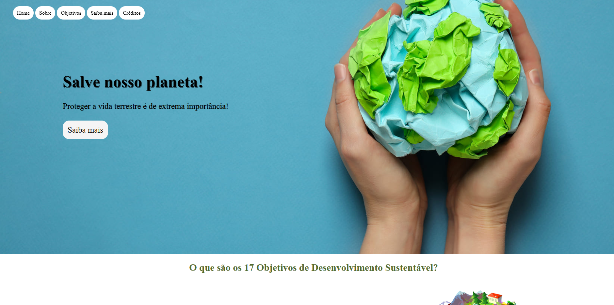

# Página de Aterragem dos ODS - ONU 🌍🌱

Bem-vindo à nossa Página de Aterragem dedicada ao 17º Objetivo de Desenvolvimento Sustentável (ODS) da ONU: "Vida Terrestre"! Aqui, estamos empenhados em promover e conscientizar sobre a importância da vida terrestre e da biodiversidade. 🌿

Acesse [aqui](https://germanavaz.github.io/ods-onu/)!

## 🚀 Sobre o Projeto

Esta Landing Page foi criada durante o bootcamp "Elas na Tech". Nossa missão? Desenvolver uma página envolvente e informativa dedicada ao ODS 17, usando as tecnologias HTML, CSS e JavaScript. O resultado é uma página cheia de vida, assim como a terra que estamos comprometidos em proteger! 🌎

## 💻 Tecnologias Utilizadas

- HTML
- CSS
- JavaScript

## 🌿 Explore a Vida Terrestre

Nossa página apresenta:

- **Informações Impactantes:** Descubra fatos e números essenciais sobre o ODS 17.
- **Recursos Educativos:** Acesse links úteis e recursos para aprender mais.
- **Compromisso Sustentável:** Saiba como você pode contribuir para a vida terrestre.

## 🌿 Conscientização é a Chave

Obrigado por visitar nossa Página de Aterragem dos ODS da ONU. Vamos trabalhar juntos para proteger a vida terrestre e fazer do nosso planeta um lugar melhor para todos os seres vivos! 🌱🌎
